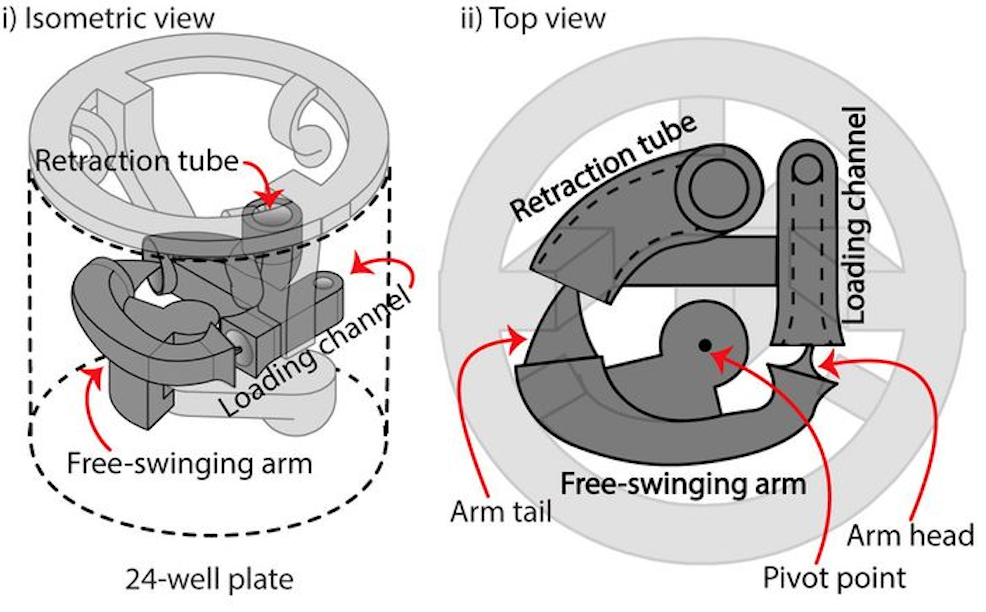
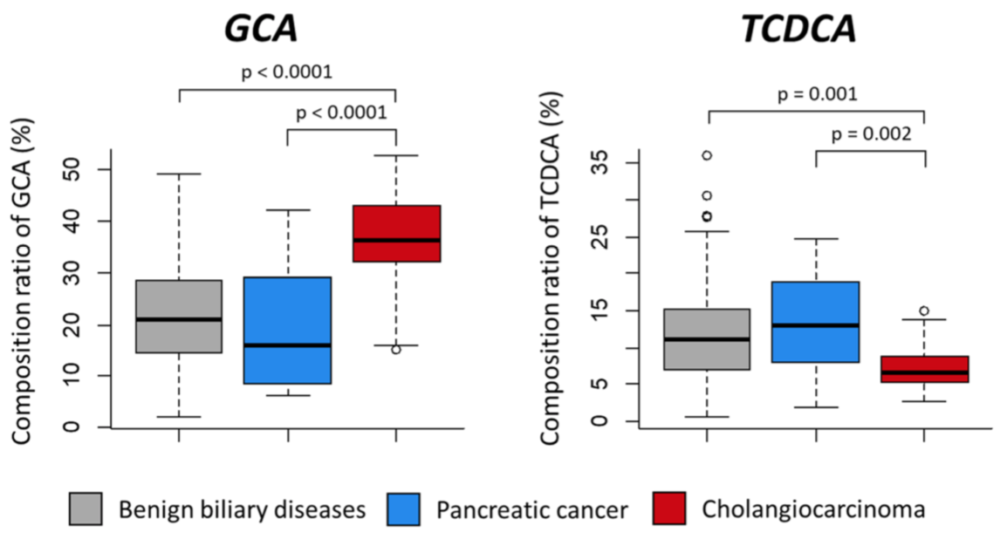
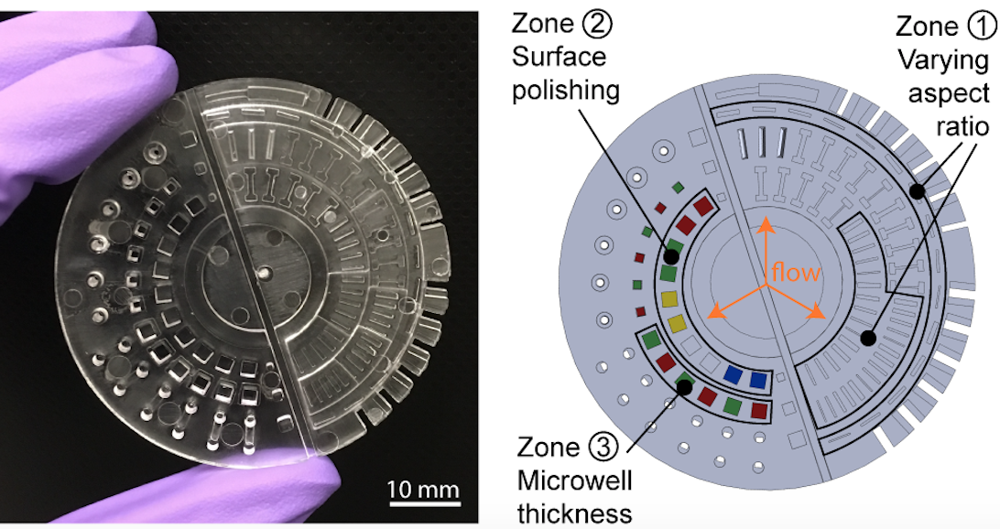
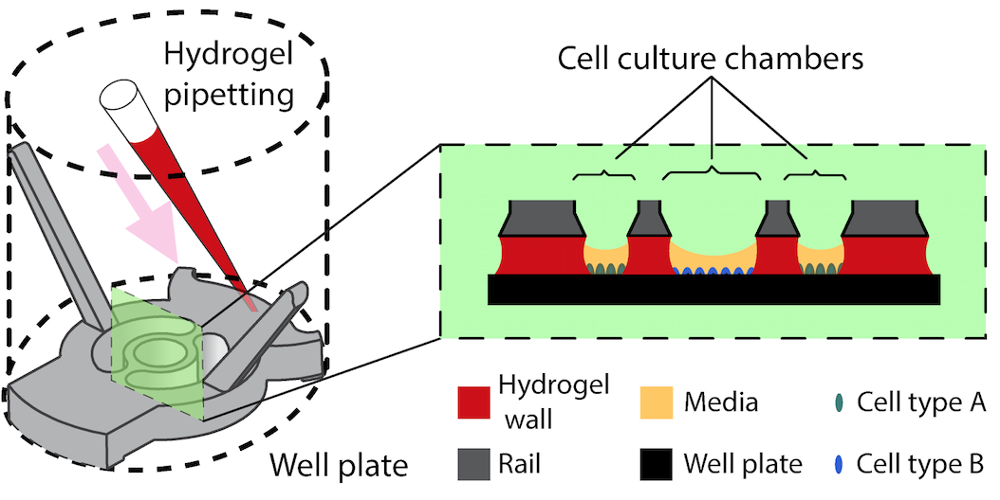
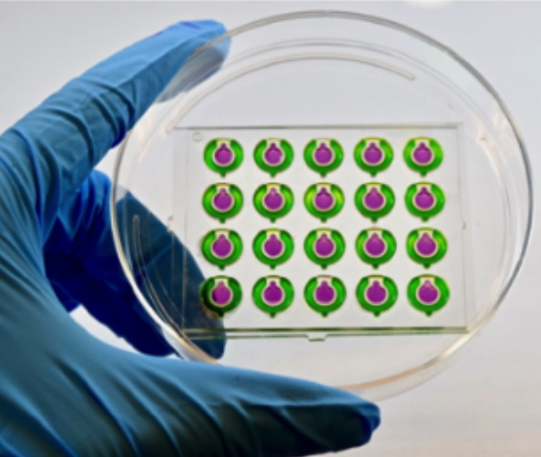
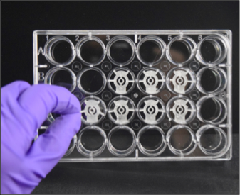

# Research

  <text style="font-weight: bold;"><a href="https://www.biorxiv.org/content/10.1101/628230v1">Investigating Fibroblast-induced Collagen Gel Contraction Using A Dynamic Microscale Platform</a></text>
  
(MicroTAS 2019, Basel, Switzerland, 27-31 October, 2019) Oral

  
<text style="font-weight: bold;">T. Zhang*</text>, J. H. Day*, X. Su, A. G. Guadarrama, N. K. Sandbo, S. Esnault, L. C. Denlinger, E. Berthier, A. B. Theberge

  <text style="font-weight: bold;"><a href="https://www.biorxiv.org/content/10.1101/628230v1">Open Microfluidic Coculture Facilitates Bidirectional Signaling Between Endothelial And Epithelial Cells</a></text>
  
(MicroTAS 2019, Basel, Switzerland, 27-31 October, 2019) Poster

  
<text style="font-weight: bold;">T. Zhang*</text>, D. Lih, Ryan J. Nagao, Jun Xue, Erwin Berthier, Jonathan Himmelfarb, Ying Zheng, Ashleigh B. Theberge

	<text style="font-weight: bold;"><a href="https://www.biorxiv.org/content/10.1101/628230v1">Investigating fibroblast-induced collagen gel contraction using a dynamic microscale platform</a></text>
	
(Submitted to Front. Bioeng. Biotechnol.)

	
<text style="font-weight: bold;">T. Zhang*</text>, J. H. Day*, X. Su, A. G. Guadarrama, N. K. Sandbo, S. Esnault, L. C. Denlinger, E. Berthier, A. B. Theberge

<table style="width:100%" class="research-tbl">
  <tr>
    <td width="200px" style="border: none"></td>
    <td style="border: none">We developed a microscale CGC assay with an engineered well plate insert that uses surface tension forces to load and manipulate small volumes (14 µL) of cell-laden collagen. We established an eosinophil-fibroblast coculture model using the CGC device and showed that the platform sustained segregated coculture and paracrine signaling to recapitulate aspects of immune-fibroblast-ECM interactions.</td> 
  </tr>
</table>

	<text style="font-weight: bold;"><a href="https://www.nature.com/articles/s41598-018-29445-z">Discovery of glycocholic acid and taurochenodeoxycholic acid as phenotypic biomarkers in cholangiocarcinoma</a></text>
	
(Scientific Reports, 2018. 8, 11088.)

	
W. S. Song, H. M. Park, J. M. Ha, S. G. Shin, H. G. Park, J. Kim, <text style="font-weight: bold;">T. Zhang</text>, D. H. Ahn, S. M. Kim, Y. H. Yang, J. H. Jeong, A. B. Theberge, B. G. Kim, J. K. Lee, Y. G. Kim

<table style="width:100%" class="research-tbl">
  <tr>
    <td width="200px" style="border: none"></td>
    <td style="border: none">Cholangiocarcinoma (CCA) biomarkers are associated with low specificity or have not been validated in relation to the biological effects of CCA. In this study, we used LC-MS/MS to quantitatively analyze 15 biliary bile acids in patients diagnosed with CCA, benign biliary disease (BBD) and pancreatic cancer (PC) and discovered glycocholic acid (GCA) and taurochenodeoxycholic acid (TCDCA) as specific CCA biomarkers.</td> 
  </tr>
</table>

	<text style="font-weight: bold;"><a href="https://pubs.rsc.org/en/content/articlelanding/2018/lc/c7lc01052d#!divAbstract">Fundamentals of rapid injection molding for microfluidic cell-based assays</a></text>
	
(Lab Chip, 2018. 18, 496.)

	
U. N. Lee, X. Su, D.J. Guckenberger, A. M. Dostie, <text style="font-weight: bold;">T. Zhang</text>, E. Berthier, A. B. Theberge

<table style="width:100%" class="research-tbl">
  <tr>
    <td width="200px" style="border: none;"></td>
    <td style="border: none">We characterize advantages and limitations of rapid injection molding for microfluidic device fabrication, and demonstrated phase contrast and fluorescence imaging of cells grown in rapid injection molded devices and provide design recommendations to successfully utilize rapid injection molding methods for microscale cell-based assay development in academic laboratory settings.</td> 
  </tr>
</table>

	<text style="font-weight: bold;"><a href="https://pubs.rsc.org/en/content/articlelanding/2017/lc/c7lc00878c#!divAbstract">Upgrading well plates using open microfluidic patterning</a></text>
	
(Lab Chip, 2018. 18, 496.)

	
S. B. Berry*, <text style="font-weight: bold;">T. Zhang*</text>, J. H. Day, X. Su, I. Z. Wilson, E. Berthier, A. B. Theberge

<table style="width:100%" class="research-tbl">
  <tr>
    <td width="200px" style="border: none"></td>
    <td style="border: none">Cellular communication between multiple cell types is a ubiquitous process that is responsible for vital physiological responses observed in vivo. We present a new open-microfluidic platform, which patterns biocompatible hydrogel walls via microfluidic spontaneous capillary flow (SCF) along a rail insert set inside commercially available cultureware. Our system creates customized pipette-accessible cell culture chambers that require fewer cells than standard macroscale culture.</td> 
  </tr>
</table>

  <text style="font-weight: bold;"><a href="https://conferences.embs.org/mnm">Studying paracrine signaling between human kidney vascular endothelial and tubular epithelial cells using open microfluidic coculture</a></text>
  
(IEEE EMBS Micro and Nanotechnology in Medicine Conference, Kauai, HI, Dec 10-14, 2018.)

  
<text style="font-weight: bold;">T. Zhang</text>, Daniel Lih, Ryan J. Nagao, Xiaojing Su, Erwin Berthier, Jonathan Himmelfarb, Ying Zheng , and Ashleigh B. Theberge

<table style="width:100%" class="research-tbl">
  <tr>
    <td width="200px" style="border: none"></td>
    <td style="border: none">We studied cell signaling between primary human kidney peritubular microvascular endothelial cells  (HKMECs) and human kidney proximal tubule epithelial cells (HPTECs) using an open microfluidic coculture platform consisting of a center and a side culture chamber segregated by a half wall.</td> 
  </tr>
</table>

  <text style="font-weight: bold;"><a href="https://www.grc.org/physics-and-chemistry-of-microfluidics-conference/2017">Upgrading well plates: Virtual multiculture devices on demand</a></text>
  
(Gordon Research Conference on the Physics and Chemistry of Microfluidics, Lucca, Italy, June 4-9, 2017.)

  
<text style="font-weight: bold;">T. Zhang</text>, John Day, Ilham Wilson, Xiaojing Su, Loren C. Denlinger, Erwin Berthier, and Ashleigh B.Theberge

<table style="width:100%" class="research-tbl">
  <tr>
    <td width="200px" style="border: none"></td>
    <td style="border: none">We utilize open microfluidics and the principle of spontaneous capillary flow (SCF) to develop a microscale hydrogel wall patterning technology that enables the study of intercellular signaling events within existing well plate culture platforms.</td> 
  </tr>
</table>
